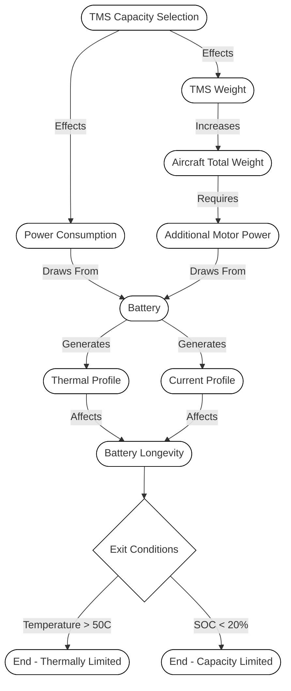

```mermaid
graph TD
A([TMS Capacity Selection]):::whiteBox-->|Effects|B1([Power Consumption]):::whiteBox
A-->|Effects|B2([TMS Weight]):::whiteBox
B2-->|Increases|C1([Aircraft Total Weight]):::whiteBox
C1-->|Requires|C2([Additional Motor Power]):::whiteBox
B1-->|Draws From|D([Battery]):::whiteBox
C2-->|Draws From|D
D-->|Generates|E1([Thermal Profile]):::whiteBox
D-->|Generates|E2([Current Profile]):::whiteBox
E1-->|Affects|F([Battery Longevity]):::whiteBox
E2-->|Affects|F
F-->G{Exit Conditions}:::whiteDiamond
G-->|Temperature > 50C|H1([End - Thermally Limited]):::whiteBox
G-->|SOC < 20%|H2([End - Capacity Limited]):::whiteBox


classDef whiteBox fill:#ffffff,stroke:#000000,stroke-width:1px;
classDef whiteDiamond fill:#ffffff,stroke:#000000,stroke-width:1px;


```
